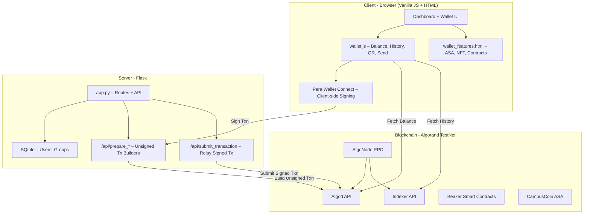
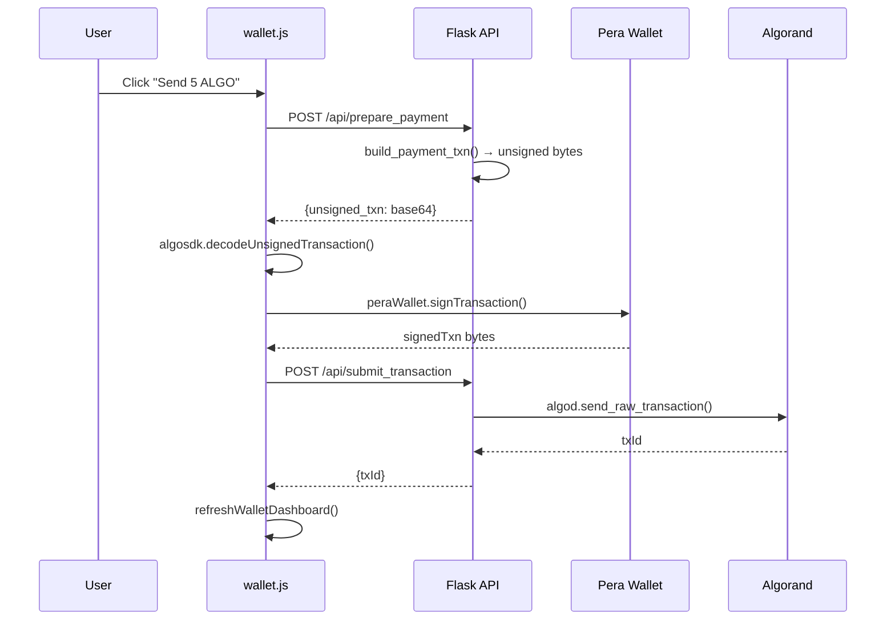
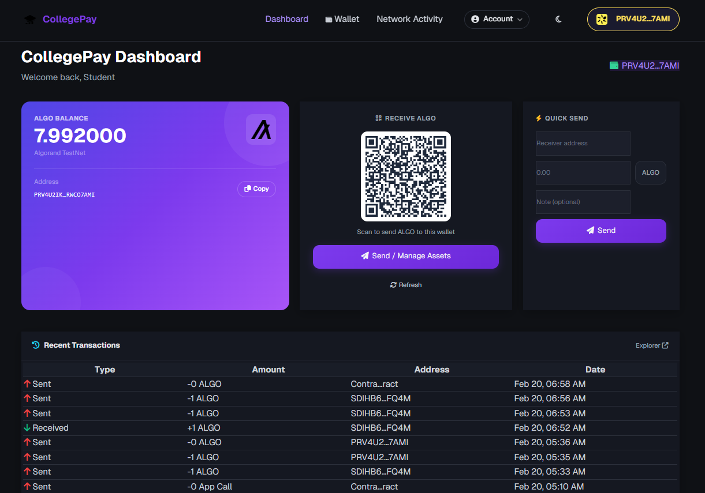
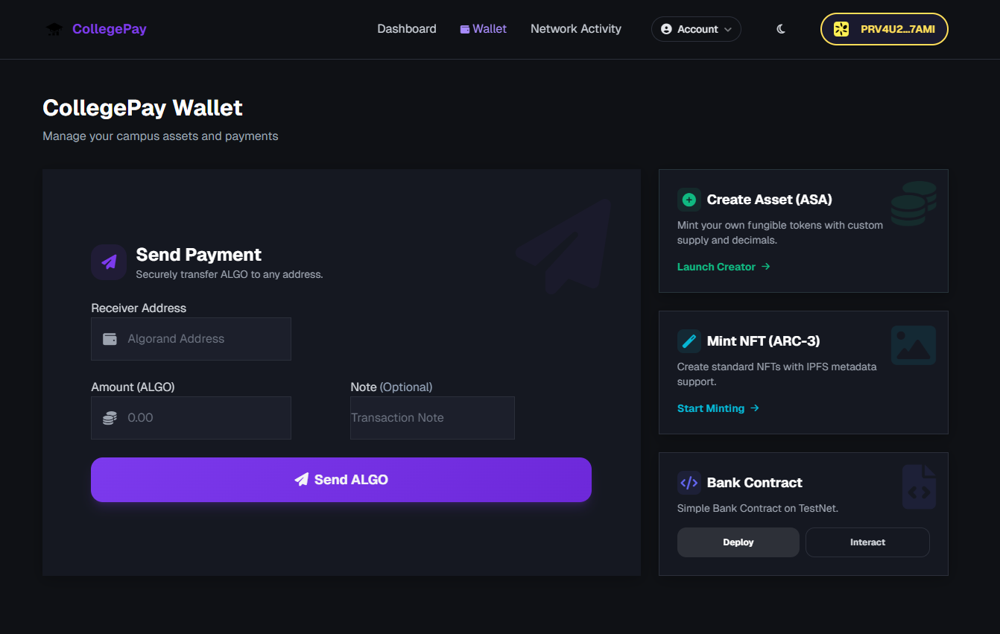
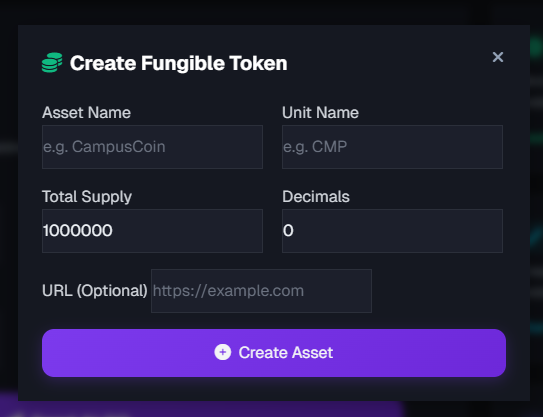

# CollegePay — Blockchain-Powered Campus Management System

[](https://www.algorand.com/)
[](https://www.python.org/)
[](https://flask.palletsprojects.com/)
[](https://pyteal.readthedocs.io/)
[](https://perawallet.app/)
[](LICENSE)

> A decentralized campus management platform with a wallet-first dashboard. Connect Pera Wallet to send/receive ALGO, view token holdings, track transactions, and collaborate in groups — all anchored on Algorand TestNet with zero server-side signing.

### 🔗 Live Demo: [https://rift-lac.vercel.app/](https://rift-lac.vercel.app/)

### 📹 LinkedIn Post: [CollegePay Demo Video](https://www.linkedin.com/posts/gauravst1_this-is-our-project-collegepay-please-ugcPost-7430437600248832000-Y1Tc?utm_source=share&utm_medium=member_desktop&rcm=ACoAAFY0ZbUBOIHC9oOT-Q3YQ1U2-C8Az_2E6nw)

---

## Table of Contents

- [Project Overview](#-project-overview)
- [System Architecture](#-system-architecture)
- [Features](#-features)
- [Tech Stack](#-tech-stack)
- [Project Structure](#-project-structure)
- [Installation & Setup](#-installation--setup)
- [API Reference](#-api-reference)
- [Smart Contracts](#-smart-contracts)
- [Cost Breakdown](#-cost-breakdown)
- [Testing](#-testing)
- [Deployment](#-deployment)
- [Security](#-security)
- [Future Roadmap](#-future-roadmap)
- [Usage Guide (Screenshots)](#-usage-guide-screenshots)
- [Known Limitations](#-known-limitations)
- [Contributing](#-contributing)
- [License](#-license)
- [Acknowledgments](#-acknowledgments)

---

## 📌 Project Overview

### The Problem

Traditional campus management systems suffer from:

- **No Student Wallet** — no unified way to send/receive campus payments
- **Trust Deficit** — no immutable proof of achievements or participation
- **Collaboration Opacity** — group work lacks verifiable tracking

### Our Solution

CollegePay is built around a **wallet-first** design using Algorand blockchain:

| Capability | How It Works |
|---|---|
| **Campus Wallet** | Connect Pera Wallet → live ALGO balance, ASA tokens, QR receive, quick send |
| **Group Collaboration** | Tasks & milestones logged on-chain → verifiable contributions |
| **CampusCoin (CCOIN)** | Custom ASA token for campus rewards & payments |

### Why Algorand?

| Traditional DB | Algorand |
|---|---|
| ❌ Centralized control | ✅ Decentralized verification |
| ❌ Mutable records | ✅ Immutable proof |
| ❌ Single point of failure | ✅ 4.5s finality, Pure PoS |
| ❌ No public audit | ✅ Transparent transaction history |
| ❌ ~$0.50/verification | ✅ ~$0.0003/transaction |

### Real-World Use Cases

1. **Universities** — Manage campus payments and group collaboration on-chain
2. **Student Organizations** — Track collaborative projects with blockchain-backed milestones
3. **Campus Groups** — Track collaborative projects with blockchain-backed milestones
4. **Token Economies** — Create loyalty tokens or campus currencies

---

## 🧠 System Architecture

### High-Level Architecture



### Key Design Principle: No Server-Side Signing

```
User → Server builds UNSIGNED tx → Pera Wallet SIGNS → Server relays
```

All private key operations happen in the user's Pera Wallet. The server never touches mnemonics for user transactions.

### On-Chain vs Off-Chain Logic

| Component | Storage | Reason |
|---|---|---|
| User credentials | Off-Chain (SQLite) | Privacy, fast auth |
| Group milestones | On-Chain (Algorand) | Permanent achievement records |
| Token metadata | On-Chain (ASA) | Decentralized asset management |
| Smart contract state | On-Chain (App State) | Trustless execution |
| Transaction logs | Hybrid (DB + Chain) | Audit trail redundancy |

### Transaction Lifecycle



---

## 🚀 Features

### 1. Wallet-First Dashboard

The dashboard displays your wallet prominently at the top:

- **Balance Card** — live ALGO balance from AlgoNode API
- **Receive QR** — scannable QR code of your Algorand address
- **Quick Send** — 3-field form for instant ALGO payments
- **Token Holdings** — all ASAs held (name, unit, amount)
- **Transaction History** — last 8 txns with type, amount, date, explorer links
- Auto-toggles between "Connect Wallet" CTA and full wallet panel

### 2. Group Collaboration & DAO

- Create/join project groups, assign tasks/milestones
- Task completions logged on-chain as immutable records
- DAO treasury per group (Beaker `campus_dao` contract)
- Full proposal lifecycle: create → vote → approve → execute (on-chain disbursement)

### 3. Advanced Wallet Features (`/wallet/features`)

Four-tab interface:

- **Send ALGO** — payment with custom notes
- **Create Token** — fungible ASA with configurable supply/decimals
- **Mint NFT** — unique achievement badges with IPFS URLs
- **Smart Contract** — deploy & interact with bank contracts

### 4. CampusCoin (CCOIN)

- Custom Algorand Standard Asset: `CampusCoin` / `CAMPUS` / 6 decimals
- Deploy via `/api/prepare_campus_coin_deploy` + Pera signing
- Used for campus rewards, attendance incentives, group payments
- State persisted in `system_state.json`

---

## 🏗️ Tech Stack

### Blockchain

| Technology | Purpose |
|---|---|
| **Algorand TestNet** | Layer-1 blockchain (4.5s finality, ~$0.001/tx) |
| **py-algorand-sdk 2.0+** | Build unsigned transactions server-side |
| **algosdk.js 2.4.0 (CDN)** | Decode transactions client-side |
| **Pera Wallet Connect 1.5+** | Client-side transaction signing |
| **Beaker (PyTeal)** | Smart contracts: campus_bank, campus_dao |
| **AlgoNode** | Free RPC (algod + indexer) — no API key needed |

### Backend

| Technology | Purpose |
|---|---|
| **Flask 2.3+** | Web framework & REST API |
| **SQLite** | User data, groups |
| **Gunicorn** | Production WSGI server |
| **python-dotenv** | Environment variable management |

### Frontend (Vanilla JS + HTML — No React/Angular/Vue)

| Technology | Purpose |
|---|---|
| **Vanilla JavaScript** | Core wallet logic, DOM manipulation, API calls — no framework |
| **HTML + Jinja2** | Server-side templating with Bootstrap layout |
| **Bootstrap 5.3** | Responsive UI framework (CSS only) |
| **wallet.js** | Wallet core: balance, history, QR, send, toasts |
| **algosdk.js 2.7.0 (CDN)** | Client-side transaction building |
| **Pera Wallet bundle** | Webpack-compiled `@perawallet/connect` |
| **qrcodejs** | QR code generation for addresses |
| **Font Awesome 6** | Icons |

---

## 📂 Project Structure

```
CollegePay-blockchain/
│
├── contracts/                     # AlgoKit / Beaker smart contracts
│   ├── campus_bank.py             # Deposit/withdraw ALGO (Beaker Application)
│   ├── campus_dao.py              # DAO treasury + disburse (Beaker Application)
│   ├── campus_coin.py             # CampusCoin ASA deployment helper
│   ├── deploy.py                  # AlgoKit CLI deploy script (--compile / --deploy)
│   └── __init__.py
│
├── algorand/                      # Blockchain integration layer
│   ├── connect.py                 # get_client(), get_indexer(), get_suggested_params()
│   ├── store_hash.py              # build_note_txn(), submit_signed_txn()
│   ├── advanced_features.py       # Unsigned tx builders + submit helpers
│   ├── update_contract.py         # Contract update utility
│   └── contracts/                 # Original PyTeal source contracts
│       ├── simple_bank.py         # PyTeal bank contract
│       ├── simple_dao.py          # PyTeal DAO contract
│       └── debug_contract.py      # Debug contract utility
│
├── utils/                         # Server-side helpers
│   ├── hash_utils.py              # SHA-256 file hashing
│   ├── blockchain_utils.py        # Blockchain utility helpers (unsigned txn builders)
│   ├── rewards.py                 # CampusCoin reward system (unsigned txn builders)
│   └── auth_utils.py              # Authentication helpers
│
├── templates/                     # Jinja2 HTML templates
│   ├── base.html                  # Layout: navbar, CDN scripts
│   ├── dashboard.html             # Wallet-first dashboard + campus feature tabs
│   ├── wallet_features.html       # Advanced: Send ALGO, Create ASA, Mint NFT, Contracts
│   ├── group_*.html               # Create, detail, discover, admin
│   ├── login.html / register.html # Authentication pages
│   └── public_logs.html           # On-chain transaction browser
│
├── static/
│   ├── css/style.css              # Custom styles + wallet dashboard CSS
│   ├── js/
│   │   ├── wallet.js              # Wallet core v2.0 (connect, balance, history, QR, send)
│   │   ├── perawallet-bundle.js   # Webpack-compiled Pera SDK
│   │   └── script.js              # Legacy utilities
│
├── tests/
│   ├── test_fixes.py              # Core feature tests (15 tests)
│   ├── test_wallet.py             # Wallet API tests (7 tests)
│   └── test_analytics.py          # Analytics tests
│
├── app.py                         # Main Flask application (~2500 lines)
├── requirements.txt               # Python dependencies
├── package.json                   # Node deps (Pera Wallet SDK, webpack)
├── webpack.config.js              # Webpack → perawallet-bundle.js
├── pera_entry.js                  # Webpack entry point
├── system_state.json              # CampusCoin state persistence
├── Procfile                       # Production deployment (Gunicorn)
└── README.md                      # This file
```

---

## ⚙️ Installation & Setup

### Prerequisites

- **Python 3.8+** with pip
- **Node.js 16+** with npm (for webpack / Pera bundle)
- **Pera Wallet** mobile app ([iOS](https://apps.apple.com/app/pera-algo-wallet/id1459898525) / [Android](https://play.google.com/store/apps/details?id=com.algorand.android))

### Step 1: Clone & Install

```bash
git clone https://github.com/Helly121/CollegePay-blockchain.git
cd CollegePay-blockchain

# Python dependencies
pip install -r requirements.txt

# Node dependencies (Pera Wallet SDK + Webpack)
npm install
npm run build
```

### Step 2: Configure Environment

```bash
cp .env.example .env
```

Edit `.env`:

```bash
# Required
FLASK_SECRET_KEY=your-random-secret-key

# Algorand RPC (defaults to AlgoNode TestNet — no API key needed)
ALGOD_ADDRESS=https://testnet-api.algonode.cloud
INDEXER_ADDRESS=https://testnet-idx.algonode.cloud


# CampusBank App ID
BANK_APP_ID=755801824

# TestNet Explorer
# https://testnet.explorer.perawallet.app/application/755801824/

# CampusCoin ASA ID (set after deploying via wallet)
# CAMPUS_COIN_ID=
```

> ⚠️ **No `ALGO_MNEMONIC` needed!** All transaction signing happens in Pera Wallet on the client side.

### Step 3: Fund Your Pera Wallet

1. Open Pera Wallet → Settings → Developer → Switch to **TestNet**
2. Visit [Algorand TestNet Dispenser](https://lora.algokit.io/testnet/fund)
3. Paste your address → receive free TestNet ALGO

### Step 4: Run

```bash
python app.py
# → http://127.0.0.1:5000
```

1. Register an account at `/register`
2. Click **Connect Wallet** in the navbar → scan QR with Pera
3. Dashboard shows live balance, receive QR, transaction history
4. Use **Wallet** nav link for advanced features (ASA, NFT, contracts)

### Step 5: Deploy Smart Contracts (Optional)

```bash
# Compile Beaker contracts to TEAL
python contracts/deploy.py --compile

# Deploy to TestNet (requires DEPLOYER_MNEMONIC in .env)
python contracts/deploy.py --deploy
```

### Step 6: Deploy CampusCoin (Optional)

1. Connect Pera Wallet on the site
2. POST to `/api/prepare_campus_coin_deploy` with `{sender: "YOUR_ADDRESS"}`
3. Sign the returned transaction in Pera
4. Submit via `/api/submit_transaction`
5. Set the returned Asset ID as `CAMPUS_COIN_ID` in `.env`

---

## 🔌 API Reference

### Unsigned Transaction Builders

All return `{unsigned_txn: base64, ...metadata}`. Sign with Pera, submit via `/api/submit_transaction`.

| Endpoint | Method | Body | Description |
|---|---|---|---|
| `/api/prepare_payment` | POST | `{sender, receiver, amount, note}` | ALGO payment |
| `/api/prepare_asset_creation` | POST | `{sender, asset_name, unit_name, total, decimals, url}` | Create ASA |
| `/api/prepare_nft_minting` | POST | `{sender, asset_name, unit_name, ipfs_url}` | Mint NFT |
| `/api/prepare_bank_deposit` | POST | `{sender, app_id, amount}` | Bank deposit (group txns) |
| `/api/prepare_bank_withdraw` | POST | `{sender, app_id, amount}` | Bank withdraw |
| `/api/prepare_campus_coin_deploy` | POST | `{sender}` | Deploy CampusCoin ASA |

### Transaction Submission

| Endpoint | Method | Body | Returns |
|---|---|---|---|
| `/api/submit_transaction` | POST | `{signed_txn: base64}` or `{signed_txns: [base64]}` | `{txId}` or `{txId, assetId}` |

### Read-Only

| Endpoint | Method | Description |
|---|---|---|
| `/api/campus_coin_info` | GET | CampusCoin ASA details |

### Example: Send ALGO from JavaScript

```javascript
// 1. Build unsigned txn
const resp = await fetch("/api/prepare_payment", {
    method: "POST",
    headers: { "Content-Type": "application/json" },
    body: JSON.stringify({ sender: address, receiver: "ABC...", amount: 1.5, note: "lunch" })
});
const { unsigned_txn } = await resp.json();

// 2. Decode & sign with Pera
const txnBytes = Uint8Array.from(atob(unsigned_txn), c => c.charCodeAt(0));
const decoded = algosdk.decodeUnsignedTransaction(txnBytes);
const signed = await peraWallet.signTransaction([[{ txn: decoded }]]);

// 3. Submit
const result = await fetch("/api/submit_transaction", {
    method: "POST",
    headers: { "Content-Type": "application/json" },
    body: JSON.stringify({ signed_txn: btoa(String.fromCharCode(...signed[0])) })
});
const { txId } = await result.json();
console.log("Transaction:", txId);
```

---

## 🔐 Smart Contracts

### CampusBank (`contracts/campus_bank.py`)

- `deposit()` — accept ALGO via atomic grouped payment + app call
- `withdraw()` — inner transaction sends ALGO to caller (creator only)
- Global state: `Creator` address for access control

### CampusDAO (`contracts/campus_dao.py`)

- `disburse(recipient, amount)` — distribute funds from DAO treasury
- Creator-controlled access for group treasuries
- Inner transactions for automated payments
- Tracks `total_disbursements` in global state

### Security Features

- Access control: only creator can withdraw/disburse
- Reentrancy protection: Algorand atomic transactions by design
- Integer overflow protection: PyTeal safe math
- Fee pooling: inner transactions share fee budget

---

## ⛽ Cost Breakdown

| Operation | Cost (ALGO) | ~USD* |
|---|---|---|
| ALGO payment | 0.001 | $0.0003 |
| ASA creation | 0.1 | $0.03 |
| NFT mint | 0.1 | $0.03 |
| Contract deployment | 0.1 | $0.03 |
| Bank deposit/withdraw | 0.002 | $0.0006 |

*Assuming 1 ALGO ≈ $0.30 USD

---

## 🧪 Testing

```bash
# Run all tests
python -m unittest discover tests/

# Specific suites
python tests/test_wallet.py     # 7 wallet API tests
python tests/test_fixes.py      # 15 core feature tests
python tests/test_analytics.py  # Analytics tests
```

All blockchain calls are mocked — no TestNet ALGO required for testing.

### Test Coverage

| Module | Tests | Coverage |
|---|---|---|
| Wallet Features | 7 tests | Payment, ASA, NFT, Contracts |
| Core Fixes | 15 tests | Auth, Groups |

---

## 🌍 Deployment

### Local Development

```bash
python app.py
# → http://127.0.0.1:5000 (debug mode)
```

### Production (Heroku / Railway / Render)

```bash
# Procfile already configured:
# web: gunicorn app:app --bind 0.0.0.0:$PORT --workers 3

# Set env vars in hosting dashboard, then:
git push heroku main
```

### Rebuild Pera Wallet Bundle

```bash
npm run build     # production build (one-time)
npm run dev       # watch mode for development
```

### MainNet Migration

1. Update `ALGOD_ADDRESS` and `INDEXER_ADDRESS` to mainnet endpoints
2. Fund wallet with real ALGO
3. Redeploy contracts via `contracts/deploy.py --deploy`
4. Redeploy CampusCoin ASA
5. Update `CAMPUS_COIN_ID` in `.env`

---

## 🔐 Security

| Concern | Mitigation |
|---|---|
| **Private keys** | Never on server — all signing via Pera Wallet |
| **SQL injection** | Parameterized queries throughout |
| **XSS** | Jinja2 auto-escaping enabled |
| **CSRF** | Flask session with secret key |
| **Reentrancy** | Algorand atomic transactions prevent by design |
| **Mnemonic exposure** | No `ALGO_MNEMONIC` needed; optional `DEPLOYER_MNEMONIC` for CLI only |
| **Integer overflow** | PyTeal safe math operations |

---

## 📊 Future Roadmap

- [ ] Multi-signature wallets for critical transactions
- [ ] IPFS integration for large file storage
- [ ] Mobile-responsive PWA with WalletConnect
- [ ] MainNet production deployment
- [ ] Algorand State Proofs for cross-chain verification
- [ ] Redis caching for frequently accessed data
- [ ] Token-based governance (DAO proposals)

---

## � Usage Guide (Screenshots)

### Dashboard — Your Campus Wallet at a Glance



After connecting your Pera Wallet, the **Dashboard** shows:

1. **ALGO Balance** (top-left) — Your live TestNet balance fetched from Algorand in real-time
2. **Receive QR Code** (center) — Any student can scan this to send you ALGO instantly
3. **Quick Send** (top-right) — Enter an address + amount and hit Send for fast P2P payments
4. **Recent Transactions** (bottom) — Shows your last transactions with type (Sent/Received), amount, truncated address, and date. Click **Explorer** to verify any transaction on the blockchain

**How to use:** Connect Pera Wallet → Dashboard auto-loads your balance, QR code, and transaction history. Use Quick Send for instant payments to classmates.

---

### Wallet — Advanced Blockchain Features



The **Wallet** page gives access to advanced Algorand features:

1. **Send Payment** (left panel) — Full payment form with receiver address, amount in ALGO, and an optional note. Pera Wallet pops up for approval on every send.
2. **Create Asset (ASA)** — Mint your own fungible token (e.g., club loyalty points, event tokens). Set name, unit, total supply, and decimals.
3. **Mint NFT (ARC-3)** — Create a unique non-fungible token (e.g., achievement certificate, hackathon badge) with IPFS metadata support.
4. **Bank Contract** — Interact with the deployed CampusBank smart contract. Deposit ALGO into the trustless vault or withdraw (admin only).

**How to use:** Navigate to Wallet → Click any card to open its modal → Fill the form → Pera Wallet asks for approval → Transaction confirmed on Algorand TestNet in ~4 seconds.

---

### Create Fungible Token — Token Creator Modal



The **Create Fungible Token** modal lets any student create a real Algorand Standard Asset:

- **Asset Name** — The full name (e.g., "CampusCoin")
- **Unit Name** — Short ticker symbol, max 8 chars (e.g., "CMP")
- **Total Supply** — How many tokens exist (e.g., 1,000,000)
- **Decimals** — Divisibility (0 = whole tokens only, 6 = divisible like ALGO)
- **URL** — Optional link to token metadata or project page

Hit **Create Asset** → Pera Wallet approval → Token is live on Algorand with a unique Asset ID that anyone can look up on the block explorer.

---

## ⚠️ Known Limitations

| Limitation | Details |
|---|---|
| **TestNet Only** | All transactions use Algorand TestNet. No real monetary value. Migration to MainNet requires funded accounts and redeployment. |
| **SQLite Database** | Not suitable for production-scale concurrent users. On Vercel, the DB resets on each cold start (uses `/tmp`). |
| **No Persistent Storage on Vercel** | Uploaded certificates and database changes are lost when the serverless function recycles. A production deployment would need PostgreSQL + cloud storage (S3). |
| **Single Admin Withdrawal** | The CampusBank smart contract only allows the creator (deployer) to withdraw. Multi-sig support is not yet implemented. |
| **No Real IPFS Upload** | NFT minting requires a pre-existing IPFS URL. The app does not upload files to IPFS — users must use a service like [Pinata](https://pinata.cloud/) or [NFT.Storage](https://nft.storage/) separately. |
| **Pera Wallet Required** | Users must have the Pera Wallet mobile app installed and switched to TestNet. No other wallet providers (e.g., Defly, Exodus) are supported. |
| **No Token Transfer UI** | After creating an ASA, there's no built-in UI to transfer/distribute tokens to other students. This must be done via Pera Wallet directly. |
| **Session-Based Auth** | Wallet authentication uses server-side sessions. Logging out clears the session; there's no JWT or persistent login across devices. |
| **Face ID Browser Dependency** | Attendance face recognition uses `face-api.js` in-browser, which requires camera permissions and may not work on all browsers/devices. |
| **No Rate Limiting** | API endpoints lack rate limiting, which could be exploited in a production environment. |

---

## �� Team — Aura Farmers

| Name | Role |
|---|---|
| **Chetan Shelar** (Team Leader) | Frontend & Blockchain Developer |
| **Gaurav Tiple** | Backend & DevOps Developer |

---

## 🤝 Contributing

1. Fork → `git checkout -b feature/your-feature`
2. Follow PEP 8, add tests, update docs
3. Commit format: `feat:`, `fix:`, `docs:`, `refactor:`
4. Push → Create PR

---

## 📜 License

MIT License — see [LICENSE](LICENSE).

---

## 🙏 Acknowledgments

- **Algorand Foundation** — blockchain infrastructure
- **AlgoNode** — free RPC services (no API key needed)
- **Pera Wallet** — client-side signing SDK
- **AlgoKit / Beaker** — smart contract framework
- **Flask Community** — web framework & documentation

---

**Built with ❤️ for transparent, decentralized campus management — wallet first.**