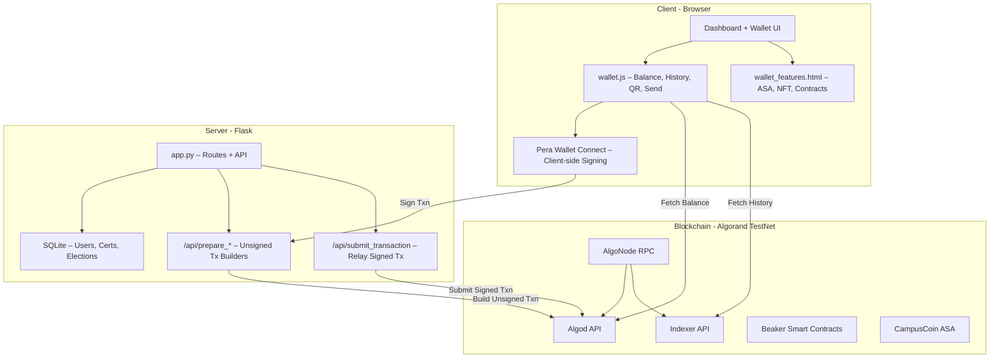

# 🛡️ CampusTrust — Blockchain-Powered Campus Wallet & Student Services

[](https://www.algorand.com/)
[](https://www.python.org/)
[](https://flask.palletsprojects.com/)
[](https://developer.algorand.org/algokit/)
[](https://perawallet.app/)
[](LICENSE)

> **A decentralized campus management platform with a wallet-first dashboard. Connect Pera Wallet to send/receive ALGO, view token holdings, track transactions, verify certificates, vote in elections, and collaborate in groups — all anchored on Algorand TestNet. Zero server-side signing.**

---

## 📌 Project Overview

### The Problem

Traditional campus management systems suffer from:

- **Certificate Fraud** — fake diplomas are trivially created and hard to verify
- **Election Manipulation** — centralized voting lacks transparency
- **No Student Wallet** — no unified way to send/receive campus payments
- **Trust Deficit** — no immutable proof of achievements or participation
- **Collaboration Opacity** — group work lacks verifiable tracking

### Our Solution

CampusTrust is built around a **wallet-first** design:

| Capability | How It Works |
|---|---|
| 💰 **Campus Wallet** | Connect Pera Wallet → live ALGO balance, ASA tokens, QR receive, quick send |
| 📜 **Certificate NFTs** | Upload cert → SHA-256 hash → stored on-chain → QR verification |
| 🗳️ **Blockchain Elections** | Votes recorded as Algorand transactions → tamper-proof results |
| 👥 **Group Collaboration** | Tasks & milestones logged on-chain → verifiable contributions |
| 🪙 **CampusCoin (CCOIN)** | Custom ASA stablecoin for campus rewards & payments |
| 🤖 **AI Chatbot** | Gemini-powered CampusBot with attendance analytics |

### Why Algorand?

| Traditional Database | Algorand |
|---|---|
| ❌ Centralized control | ✅ Decentralized verification |
| ❌ Mutable records | ✅ Immutable proof |
| ❌ Single point of failure | ✅ 4.5s finality, Pure PoS |
| ❌ No public audit trail | ✅ Transparent transaction history |
| ❌ ~$0.50/verification | ✅ ~$0.0003/transaction |

---

## 🧠 System Architecture



### Key Design Principle: Zero Server-Side Signing

```
OLD: User → Server builds & SIGNS tx with server mnemonic → Submits
NEW: User → Server builds UNSIGNED tx → Pera Wallet SIGNS → Server relays
```

All private key operations happen in the user's Pera Wallet. The server never handles mnemonics.

### On-Chain vs Off-Chain Storage

| Component | Storage | Reason |
|---|---|---|
| User credentials | Off-Chain (SQLite) | Privacy, fast auth |
| Certificate hashes | On-Chain (Algorand) | Immutable proof, public verification |
| Election votes | On-Chain (Algorand) | Transparency, tamper-proof |
| Group milestones | On-Chain (Algorand) | Permanent achievement records |
| Token metadata | On-Chain (ASA) | Decentralized asset management |
| Smart contract state | On-Chain (App State) | Trustless execution |
| Transaction logs | Hybrid (DB + Chain) | Audit trail redundancy |

---

## 🚀 Features

### 💰 Campus Wallet
- Real-time ALGO balance via AlgoNode
- Send ALGO to any address with optional note
- View full transaction history (paginated)
- QR code for receive address
- ASA token holdings display

### 📜 Certificate Verification
- Upload PDF/image certificates
- SHA-256 hash stored on Algorand
- Tamper-proof QR codes for instant verification
- Public verification page (no login required)

### 🗳️ Blockchain Elections
- Create elections with multiple candidates
- Each vote = Algorand transaction (transparent, auditable)
- Real-time results with blockchain proof
- Admin controls: open/close/delete elections

### 👥 Group Collaboration
- Admin-created or student-formed groups
- Task assignment and completion tracking
- Milestone logging on-chain
- DAO governance: deploy proposals, vote, execute
- Group invitations and membership management

### 🪙 CampusCoin (CCOIN)
- Deploy custom ASA stablecoin
- Mint NFTs for achievements
- Reward distribution to students
- Opt-in asset management

### 🤖 AI Chatbot
- Gemini-powered CampusBot
- Attendance analytics and Q&A
- Natural language campus queries

### 📊 Attendance & Feedback
- Session-based attendance tracking
- Anonymous feedback forms
- Attendance reports by course
- Blockchain-backed audit trail

---

## 🛠️ Tech Stack

| Layer | Technology |
|---|---|
| Backend | Python 3.8+, Flask 2.3+ |
| Blockchain | Algorand TestNet via AlgoNode (free, no API key) |
| Smart Contracts | PyTeal 0.24+, Beaker 1.1+ |
| Wallet | Pera Wallet Connect SDK |
| Database | SQLite3 |
| Frontend | Bootstrap, Jinja2, Webpack |
| AI | Google Gemini API |
| Deployment | Gunicorn, Heroku/Railway/Render |

---

## ⚙️ Installation

### Prerequisites

- Python 3.8+
- Node.js 16+ (for Webpack/Pera Wallet bundle)
- [AlgoKit v2+](https://developer.algorand.org/algokit/) (optional, for contract deployment)

### Quick Start

```bash
# 1. Clone the repository
git clone https://github.com/lucifer0906/RIFT.git
cd RIFT  # CampusTrust project root

# 2. Create and activate virtual environment
python -m venv venv
source venv/bin/activate        # Linux/macOS
# venv\Scripts\activate         # Windows

# 3. Install Python dependencies
pip install -r requirements.txt

# 4. Install Node dependencies and build Pera Wallet bundle
npm install
npm run build

# 5. Configure environment
cp .env.example .env
# Edit .env with your values (see Configuration section)

# 6. Run the application
python app.py
```

Visit `http://localhost:5000` in your browser.

---

## 🔧 Configuration

Copy `.env.example` to `.env` and fill in your values:

```env
# Algorand Network (no private keys on server!)
ALGO_NETWORK=testnet
ALGOD_ADDRESS=https://testnet-api.algonode.cloud
ALGOD_TOKEN=
INDEXER_ADDRESS=https://testnet-idx.algonode.cloud
INDEXER_TOKEN=

# Certificate Store App ID (deployed via AlgoKit)
CERT_APP_ID=755556381

# CampusCoin ASA ID (set after deploying via /api/prepare_campus_coin_deploy)
# CAMPUS_COIN_ID=

# Flask
FLASK_SECRET_KEY=your-secret-key-here
FLASK_ENV=development

# Database
DATABASE_PATH=database/campus.db

# Gemini AI Chatbot
GEMINI_API_KEY=your-gemini-api-key-here
```

> **Note:** AlgoNode requires no API key for TestNet. `ALGOD_TOKEN` and `INDEXER_TOKEN` can be left empty.

---

## 📦 Smart Contracts

Contracts live in `contracts/` and `algorand/`:

| Contract | Description |
|---|---|
| `certificate_store.py` | Stores certificate hashes on-chain |
| `campus_bank.py` | Simple bank: deposit/withdraw ALGO |
| `campus_dao.py` | DAO governance: proposals and voting |
| `campus_coin.py` | CampusCoin (CCOIN) ASA deployment |

### Deploy Contracts

```bash
# Compile contracts
algokit project compile

# Deploy contracts
algokit project deploy

# Or directly via Python
python -m contracts.deploy --deploy
```

### Contract Interaction (Python)

```python
from algorand.advanced_features import build_bank_deposit_txns, get_contract_history

# Build unsigned deposit transaction (signed by Pera Wallet in browser)
txns = build_bank_deposit_txns(app_id=123456, sender="ADDR...", amount_algo=5.0)

# Query contract history via Indexer
history = get_contract_history(app_id=123456)
for tx in history['history']:
    print(f"{tx['action']}: {tx['amount']} ALGO by {tx['user']}")
```

---

## 🧪 Testing

```bash
# Run all tests
python -m unittest discover tests/

# Run specific test suite
python tests/test_wallet.py
```

| Module | Tests | Coverage |
|---|---|---|
| Wallet Features | 7 tests | Payment, ASA, NFT, Contracts |
| Core Fixes | 15 tests | Auth, Elections, Groups |
| Blockchain Utils | Mocked | Hash generation, note formatting |

---

## 🌍 Deployment

### Local Development

```bash
python app.py
```

### Production (Heroku / Railway / Render)

```bash
# Procfile already configured:
# web: gunicorn app:app --bind 0.0.0.0:$PORT --workers 3

# Set env vars in hosting dashboard, then:
git push heroku main
```

### Rebuild Pera Wallet Bundle

```bash
npm run build     # production build
npm run dev       # watch mode for development
```

### MainNet Migration

1. Update `ALGOD_ADDRESS` and `INDEXER_ADDRESS` to mainnet endpoints
2. Fund wallet with real ALGO
3. Redeploy contracts via `python -m contracts.deploy --deploy`
4. Redeploy CampusCoin ASA
5. Update `CERT_APP_ID` and `CAMPUS_COIN_ID` in `.env`

> ⚠️ **WARNING:** MainNet uses real ALGO with monetary value. Always audit contracts before production use.

---

## 🔐 Security

| Concern | Mitigation |
|---|---|
| **Private keys** | Never on server — all signing via Pera Wallet |
| **SQL injection** | Parameterized queries throughout |
| **XSS** | Jinja2 auto-escaping enabled |
| **CSRF** | Flask session with secret key |
| **Reentrancy** | Algorand atomic transactions prevent by design |
| **Mnemonic exposure** | No server mnemonic; optional `DEPLOYER_MNEMONIC` for CLI deploy only |
| **Rate limiting** | Gemini API retries with exponential backoff |

---

## 📊 Roadmap

- [ ] Multi-signature wallets for critical transactions
- [ ] Delegated voting in elections
- [ ] IPFS integration for large file storage
- [ ] React Native mobile app with WalletConnect
- [ ] MainNet production deployment
- [ ] Algorand State Proofs for cross-chain verification
- [ ] Redis caching for frequently accessed blockchain data
- [ ] Token-based DAO governance (on-chain proposals)

---

## 🤝 Contributing

1. Fork → `git checkout -b feature/your-feature`
2. Follow PEP 8, add tests, update docs
3. Commit format: `feat:`, `fix:`, `docs:`, `refactor:`
4. Push → Create PR

---

## 📜 License

MIT License — see [LICENSE](LICENSE).

---

## 🙏 Acknowledgments

- **Algorand Foundation** — blockchain infrastructure
- **AlgoNode** — free RPC services (no API key needed)
- **Pera Wallet** — client-side signing SDK
- **AlgoKit / Beaker** — smart contract framework
- **Flask Community** — web framework & documentation
- **Google Gemini** — AI chatbot engine

---

**Built with ❤️ for transparent, decentralized campus management — wallet first.**
